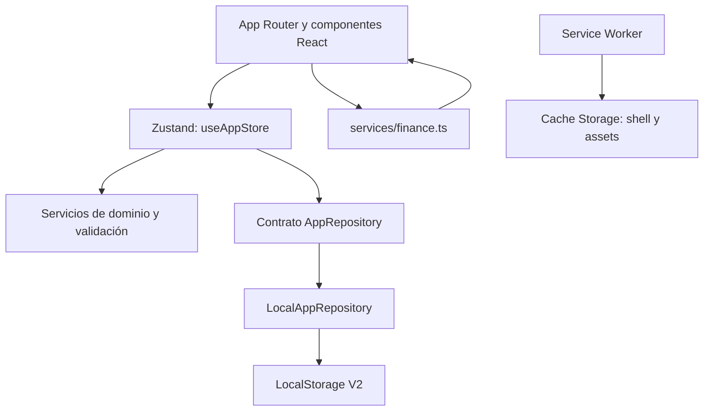

# Arquitectura de Nexo Local V1

## Principios

- **Local-first:** el estado útil está disponible en el dispositivo sin depender de una API.
- **Valores derivados:** saldos, patrimonio y reportes se calculan desde entidades persistidas.
- **Abstracción de repositorio:** `AppRepository` separa el store del mecanismo local.
- **Responsabilidades separadas:** React presenta, Zustand coordina, los servicios calculan/validan y el repositorio persiste.
- **Reemplazabilidad futura:** la UI no escribe directamente en `LocalStorage`.

## Capas principales

- `app/`: rutas de Next.js, layout, manifest y composición de vistas.
- `components/`: shell, vistas, sheet transaccional y componentes visuales.
- `domain/models.ts`: contratos del dominio persistido.
- `stores/app-store.ts`: hidratación, acciones transaccionales y commit seguro.
- `services/`: cálculos, dinero, fechas, esquema, backup, seed y fixtures RC.
- `repositories/local/`: contrato e implementación sobre `LocalStorage`.
- `public/sw.js`: ciclo de vida y estrategia offline.

## Flujo de datos

Al crear un gasto:

1. `TransactionSheet` valida los campos inmediatos.
2. `useAppStore.addTransaction` valida monto, fecha, cuenta y transferencia.
3. Se crea una copia completa de `AppData` con ID y timestamps.
4. `LocalAppRepository.save` valida el esquema y llama una sola vez a `localStorage.setItem`.
5. Sólo después de guardar correctamente el store publica el nuevo estado.
6. Las vistas vuelven a derivar saldos y métricas con `services/finance.ts`.

Si la escritura falla, el estado visible anterior y el valor anterior de `LocalStorage` permanecen intactos; el error se expone en la UI.

## Separación Personal/Negocio

Cada `Transaction` tiene `workspace: "personal" | "business"`. Las consultas mensuales filtran período y workspace. Cuentas, activos y pasivos son compartidos en el modelo patrimonial; productos e inventario pertenecen al contexto del negocio.

## Capa PWA

El Service Worker cachea HTML, manifest, iconos y assets de la aplicación. No conoce, inspecciona ni guarda el dataset financiero. Los datos continúan en `LocalStorage`; limpiar una versión vieja del caché no los elimina.

## Preparación conceptual para SQL

La separación `useAppStore → AppRepository` permitiría implementar en otra versión un `ApiRepository` detrás del mismo contrato ampliado. Eso requeriría decisiones nuevas de autenticación, concurrencia, API y migración. V1 no incluye backend, SQL ni una arquitectura de proveedor seleccionada.
